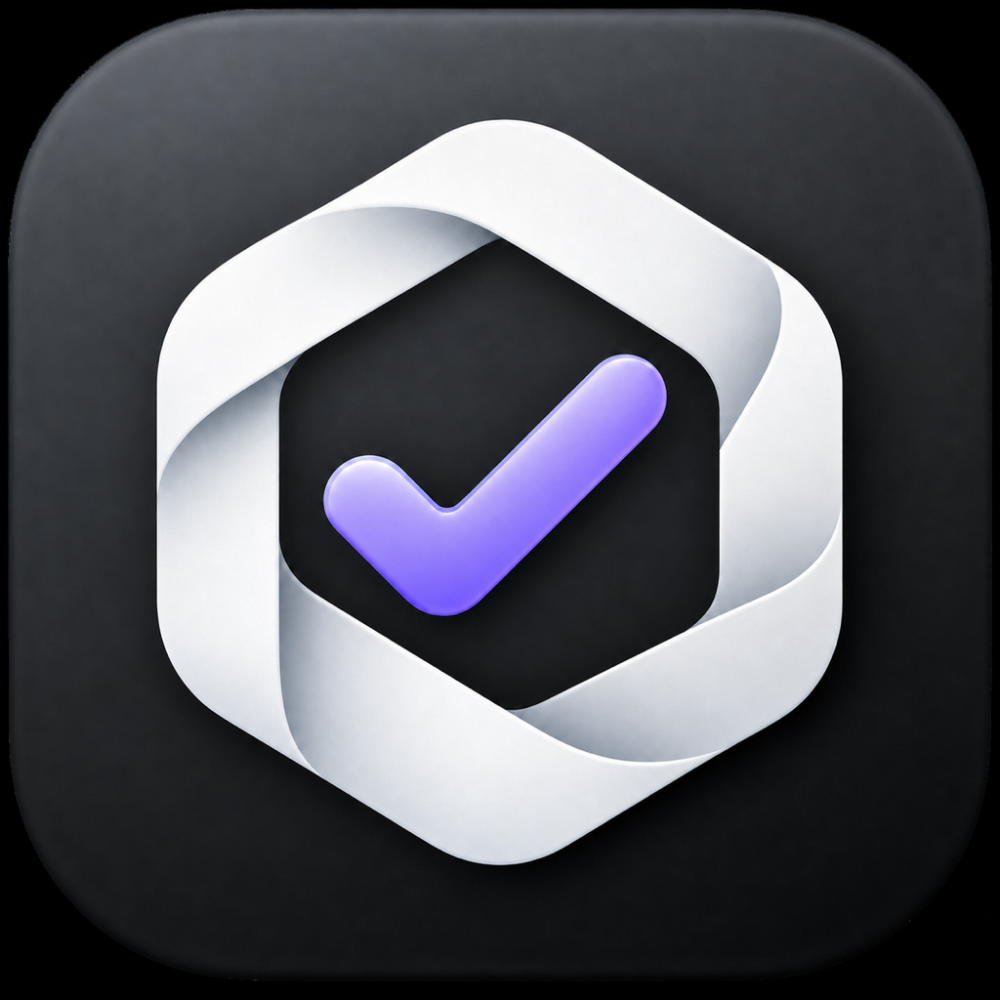

  

<h1 align="center">Signstr</h1>

Signstr is a Nostr signer for iPhone and Mac. Both apps share the same NIP-46,
NIP-55, relay, permission, and signing core while using platform-native SwiftUI
shells.

## Run the apps

Open `Signstr.xcodeproj` and select either the `Signstr` iOS scheme or the
`SignstrMac` macOS scheme. The Mac app pairs through Nostr Connect links opened
directly or pasted from the clipboard; QR camera scanning is available in the
iPhone app.

Private keys are stored as biometric-protected Keychain items. Key use requires
Touch ID on Mac or Face ID/Touch ID on iPhone when available, with the device
password/passcode as the system fallback. Apple Secure Enclave hardware cannot
perform Nostr's secp256k1 signatures directly, so Signstr performs the Nostr
operation in memory only after the Keychain access check succeeds.

## Distribution

Release preparation lives in [Distribution/README.md](Distribution/README.md). For the ordered 0.1.0 handoff, start with [Distribution/NEXT_STEPS.md](Distribution/NEXT_STEPS.md).
