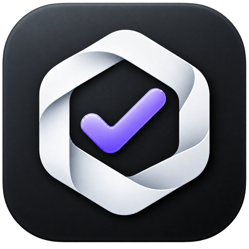

  

<h1 align="center">Signeur</h1>

Signeur is a Nostr signer for iPhone and Mac. Both apps share the same NIP-46,
NIP-55, relay, permission, and signing core while using platform-native SwiftUI
shells.

[Browse the latest SigneurCore coverage report](https://guaka.github.io/signeur/),
published from each successful `main` build with per-file annotated source.

## How to use Signeur

1. Open **Keys** and create a new key, or import an existing `nsec` private key.
2. In a Nostr app, choose **Nostr Connect** or **remote signer**, then scan its
   code on iPhone or paste its connection link on Mac.
3. Read each request and approve only the actions you expect.

**Nostr** is an open social network where apps exchange messages through relays.
Your **public key** (`npub`) is your shareable identity. Your **private key**
(`nsec`) controls that identity: keep it secret, and only import it into apps
you trust. Signeur keeps the private key on your device and uses it when you
approve a request.

Source code: [github.com/guaka/signeur](https://github.com/guaka/signeur)

## Run the apps

Open `Signeur.xcodeproj` and select either the `Signeur` iOS scheme or the
`SigneurMac` macOS scheme. The Mac app pairs through Nostr Connect links opened
directly or pasted from the clipboard; QR camera scanning is available in the
iPhone app.

## Live NIP-46 end-to-end tests

The UI tests pair each app with the published [NIP-46 tester](https://guaka.github.io/signeur/#nip46-test), approve the connection and public-key request, and verify the returned npub and acquired permissions in Safari. They use a disposable in-memory key in debug builds only.

Run both platforms with `Scripts/run-nip46-e2e.sh`, or pass `ios` or `macos` to run one platform. Because these tests depend on public relays and Safari, they run after changes land on `main`, on demand, and weekly rather than blocking pull requests. The latest per-platform results appear on the [Signeur project page](https://guaka.github.io/signeur/#e2e-results).

Private keys are stored as biometric-protected Keychain items. Key use requires
Touch ID on Mac or Face ID/Touch ID on iPhone when available, with the device
password/passcode as the system fallback. Apple Secure Enclave hardware cannot
perform Nostr's secp256k1 signatures directly, so Signeur performs the Nostr
operation in memory only after the Keychain access check succeeds.

## Distribution

Release preparation lives in [Distribution/README.md](Distribution/README.md). For the ordered 0.1.0 handoff, start with [Distribution/NEXT_STEPS.md](Distribution/NEXT_STEPS.md).

## License

Signeur is licensed under the [GNU Affero General Public License v3.0](LICENSE).
